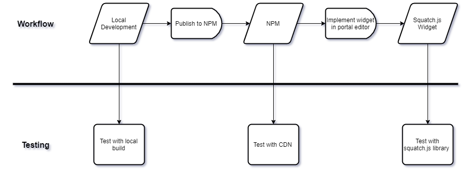

# How to build and deploy custom widgets

1. Copy the `widget-starter` folder and rename as needed
2. Create new components in [./src/components](./src/components) as new folders, for example [./src/components/sqh-my-component](./src/components/sqh-my-component)

   1. Components should be built using the [HVC pattern](https://gist.github.com/loganvolkers/3402321237d3e363a3010843c793a0bc)
   2. Controller should match the name of the folder: [sqh-my-component.tsx](./src/components/sqh-my-component/sqh-my-component.tsx)
   3. View should match the controller name + "view": [sqh-my-component-view.tsx](./src/components/sqh-my-component/sqh-my-component-view.tsx)
   4. Hook should have the prefix "use" and the Controller's class name: [useMyComponent.ts](./src/components/sqh-my-component/useMyComponent.ts)
   5. Stories should be added to provide visuals of each possible state of the component [(MyComponent.stories.tsx)](./src/stories/MyComponent.stories.tsx) and imported into [sqh-stencilbook.tsx](./src/components/sqh-stencilbook/sqh-stencilbook.tsx).
      Be sure to import any mixins used in your components into [sqh-stencilbook.scss](./src/components/sqh-stencilbook/sqh-stencilbook.scss)

3. Before you begin:

   1. Edit [stencil.config.ts](./stencil.config.ts) - update namespace to `my-theme-components`
   2. Edit [package.json](./package.json) - update name to `@saasquatch-themes/my-theme-components`

4. Develop [Stencil](https://stenciljs.com/docs/getting-started) components locally

   1. `npm start`
   2. Edit html: [index.html](./src/index.html)

5. Build and publish to NPM under personal user to `@saasquatch-themes/my-theme-components@1.0.0`
   1. `npm login`
   2. `npm run build`
      2a. Navigate to `dist/my-theme-components/my-theme-components.js` and find + remove ` window.location.origin` from the built file (only needed if loading these components in an iframe)
   3. `npm publish --access public`
6. Implement widget in portal widget editor

   1. Reference deployed components in advanced section of the widget editor:

      dependencies:

      ```
      package: @saasquatch-themes/my-theme-components
      version: 1.0.0
      filePath: /dist/mint-components/my-theme-components.js
      ```

      plugins:

      ```
      package: @saasquatch-themes/my-theme-components
      version: 1.0.0
      filePath: /grapesjs/grapesjs.js
      ```

   2. Import custom html from [index.html](./src/index.html)

7. Test widget in browser using squatch.js library
   1. go to http://squathjs-demo.surge.sh
   2. Fill out `tenantAlias`, `domain`, `user`, `widgetType` (`p/[programId]/w/referrerWidget`), and `jwt` fields for squatch `initObj` in config
   3. [jwt](https://docs.saasquatch.com/topics/json-web-tokens) can be generated at https://jwt.io using the user object from config as the payload
      ```
      {
         "user":{
            "id":"my-user-id",
            "accountId":"my-account-id"
         }
      }
      ```
      and your tenant's API key in the Verify Signature section
   4. Reload config


