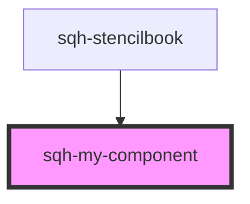

# sqh-my-component

<!-- Auto Generated Below -->

## Properties

| Property   | Attribute  | Description | Type                                                                                                                  | Default     |
| ---------- | ---------- | ----------- | --------------------------------------------------------------------------------------------------------------------- | ----------- |
| `demoData` | --         |             | `{ states?: { loading: boolean; content: { myTitle: string; }; }; data?: { firstName: string; lastName: string; }; }` | `undefined` |
| `myTitle`  | `my-title` |             | `string`                                                                                                              | `undefined` |

## Dependencies

### Used by

 - [sqh-stencilbook](../sqh-stencilbook)

### Graph

----------------------------------------------

*Built with [StencilJS](https://stenciljs.com/)*
